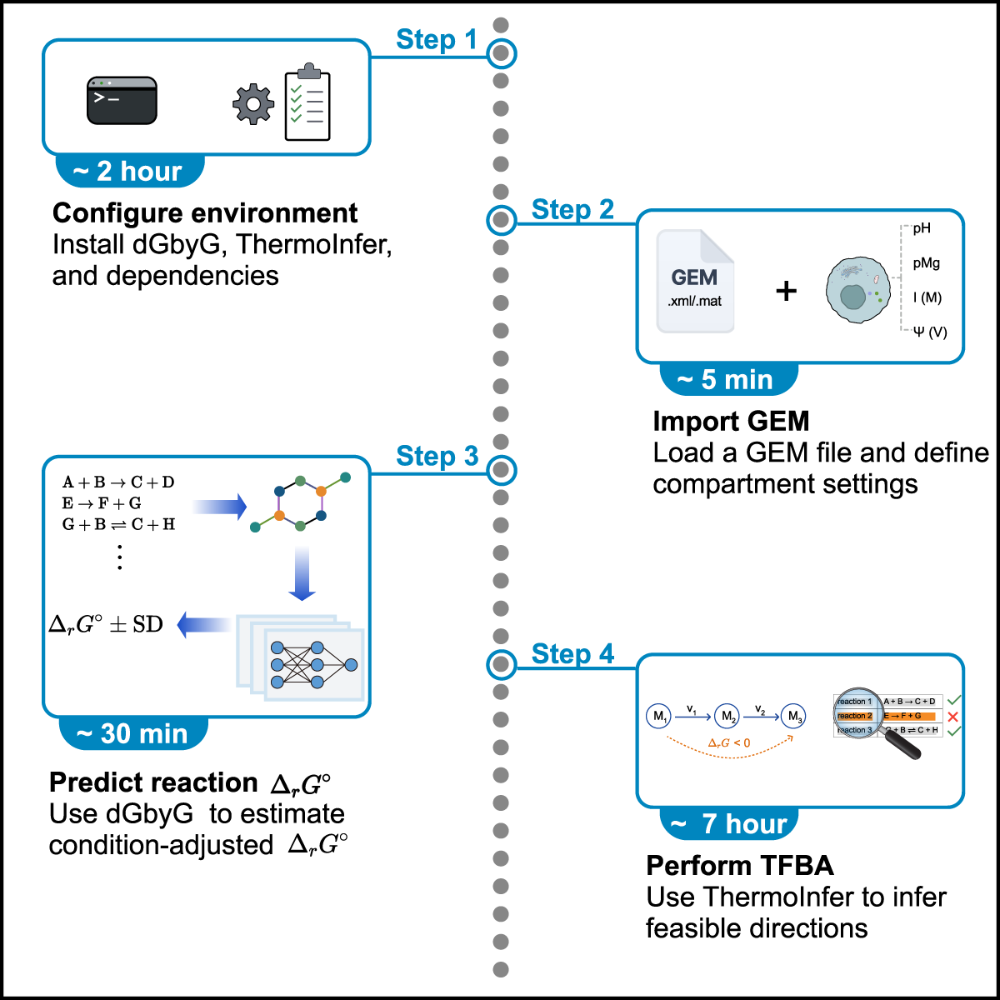

# Protocol for Predicting Gibbs Energies and Inferring Thermodynamic Directions in Genome-Scale Metabolic Models Using dGbyG and ThermoInfer
---

## Summary

Integrating reaction thermodynamics is essential for refining constraint-based metabolic models. This repository provides a computational protocol coupling the **dGbyG** package with **ThermoInfer** for thermodynamic feasibility inference. The protocol describes the setup of the computational environment and a worked Yeast-GEM example showing how dGbyG-predicted reaction standerd Gibbs energy values (ΔrG°) can be used in ThermoInfer to evaluate reaction directionality.



---

## Repository Contents

| File | Description |
|------|-------------|
| `workflow_yeast.ipynb` | Main Jupyter notebook demonstrating the full workflow |
| `run_tfba.py` |  Command-line Python script for running ThermoInfer-based TFBA using a GEM file and a dGbyG reaction-level prediction table as input |
| `yeast-GEM.xml` | Yeast genome-scale metabolic model (GEM) in XML format |
| `Yeast9_compartment_conditions.json` | Compartment-specific physicochemical conditions (pH, ionic strength, temperature, electrical potential, pMg) |
| `Yeast9_standard_dGr_dGbyG.csv` | dGbyG prediction table containing predicted ΔrG° values and their standard deviations |
| `yeast-GEM_Directionality_TFBA.csv` | ThermoInfer TFBA output containing feasible flux ranges and reaction Gibbs energy ranges |
| `Yeast9_candidate_inconsistent_reactions.csv` | Candidate reactions with thermodynamically inconsistent directionality for manual review |

---

## Before You Begin


 **dGbyG** uses graph neural networks (GNNs) to predict standard Gibbs free energies of formation for metabolites (ΔfG°), which are then used to calculate ΔrG° for reactions.
 **ThermoInfer** uses the ΔrG° prediction table within a GEM to evaluate feasible flux ranges and reaction Gibbs energy ranges via thermodynamic flux balance analysis (TFBA).

### System Requirements

Users should run this protocol in a Linux or WSL2/Ubuntu environment with **Conda** installed. A valid **Gurobi license** are required. GPU acceleration is optional.

---

## Environment Setup

### 1. Confirm Git and Git LFS Availability

```bash
git --version
git lfs version
```

If Git LFS is not available:
```bash
conda install -c conda-forge git-lfs
git lfs install
```

> **CRITICAL:** Git LFS must be initialized before cloning repositories that contain Git LFS-managed files.

### 2. Download Repositories

```bash
mkdir -p ~/dgbyg_thermoinfer_protocol
cd ~/dgbyg_thermoinfer_protocol

# Clone dGbyG
git clone https://github.com/f-wc/dGbyG.git
cd ~/dgbyg_thermoinfer_protocol/dGbyG
git checkout feature/initial
git lfs pull

# Clone ThermoInfer
cd ~/dgbyg_thermoinfer_protocol
git clone https://gitee.com/f-wc/ThermoInfer.git
```

### 3. Create and Activate Conda Environment

```bash
cd ~/dgbyg_thermoinfer_protocol/dGbyG
conda env create -f environment.yml -n dgbyg-thermoinfer
conda activate dgbyg-thermoinfer
```

Install JupyterLab, dGbyG, and ThermoInfer:

```bash
conda install -c conda-forge jupyterlab -y

cd ~/dgbyg_thermoinfer_protocol/dGbyG
python -m pip install -e .

cd ~/dgbyg_thermoinfer_protocol/ThermoInfer
python -m pip install -e .
```

### 4. Install Gurobi

```bash
conda install -c gurobi gurobi -y
```

> **CRITICAL:** Prepare a valid Gurobi license before running ThermoInfer. Academic users can obtain a free license from the [Gurobi User Portal](https://www.gurobi.com/academia/academic-program-and-licenses/).

---

## Usage

The complete workflow consists of four main stages:

### Stage 1: Load GEM and Define Compartment Conditions (JupyterLab)

Open and run `workflow_yeast.ipynb` to:
- Load the Yeast-GEM SBML model (`yeast-GEM.xml`)
- Define compartment-specific physicochemical conditions (pH, temperature, ionic strength, electrical potential, pMg)
- Save conditions to `Yeast9_compartment_conditions.json`

### Stage 2: Run dGbyG Predictions (JupyterLab)

Continue in the notebook to:
- Run dGbyG to predicted `dGr_prime` values and standard deviations for eligible reactions in the GEM
- Generate `Yeast9_standard_dGr_dGbyG.csv`.

### Stage 3: Run ThermoInfer TFBA (Terminal)

**Pause the notebook** and run the standalone TFBA script from the terminal:

```bash
python run_tfba.py yeast-GEM.xml Yeast9_standard_dGr_dGbyG.csv --compartments Yeast9_compartment_conditions.json
```

 `run_tfba.py` takes two required positional arguments: `gem_path`, the path to the GEM file, and `dgr_path`, the path to the dGbyG reaction-level prediction table. Optional arguments include `--compartments`, `--output`, `--batch-size`, `--threads`, `--biomass-fraction`, `--v-si`, `--v-ei`, and `--run-fba`.

 To view all available command-line arguments and their default values, run:

```bash
python run_tfba.py --help
```

 This command generates `yeast-GEM_Directionality_TFBA.csv`, which contains feasible flux ranges and reaction Gibbs energy ranges inferred by ThermoInfer-based TFBA.

> ** CRITICAL:** For routine execution, start with the default conservative settings, `--batch-size 20` and `--threads 5`. Increase these values only after confirming that CPU cores, memory, and Gurobi license capacity are sufficient.

> ** Note:** If TFBA is interrupted after partial results have been written, do not delete the partially generated output file. Rerun the same command using the same `--output` path. The script automatically detects the existing output file and continues from the next unfinished reaction index.

### Stage 4: Identify Candidate Reactions (JupyterLab)

Return to the notebook to:
- Load the TFBA output file
- Compare directionality labels inferred from the original GEM reaction flux bounds with TFBA-derived direction classifications based on feasible flux ranges and reaction Gibbs energy ranges
- Generate `Yeast9_candidate_inconsistent_reactions.csv` for manual review

---

## Citation

If you use this protocol or code in your research, please cite the associated study:

**Fan, W., Hao, Y., Hou, X., Ding, C., Huang, D., Zheng, W., & Dai, Z. (2025). Unraveling principles of thermodynamics for genome-scale metabolic networks using graph neural networks. *Cell Systems*, 16(10), 101393.**

---

